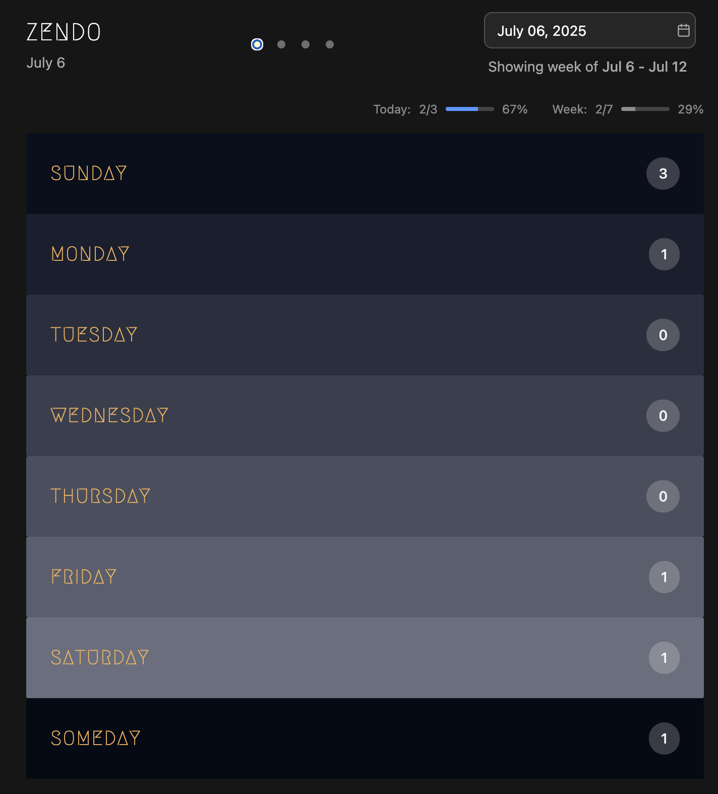
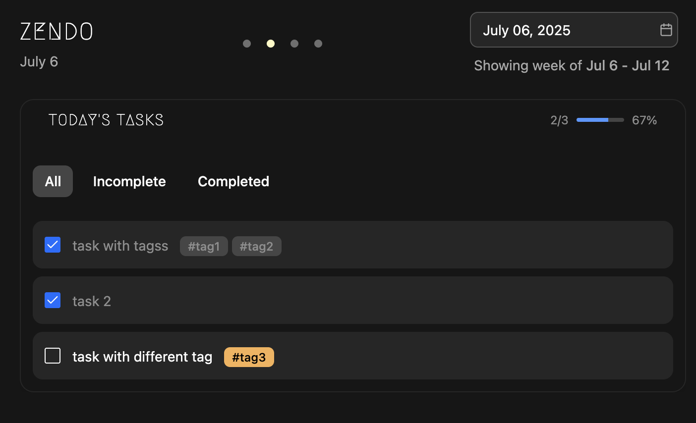
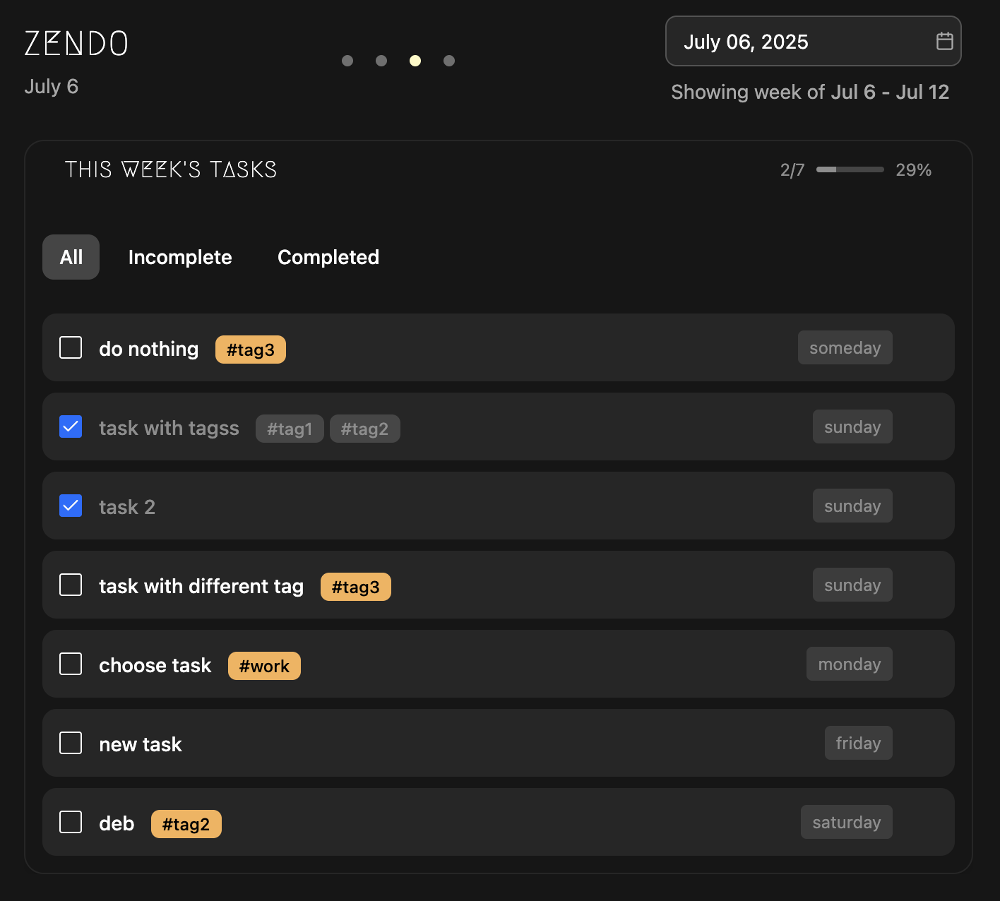

<p align="center">
  
</p>
<h1 align="center">ZenDo</h1>
<p align="center">
  Minimalist weekly task manager.<br>
  <i>Plan your week, zen-style ✅</i>
</p>

ZenDo is a minimalistic task manager that is based on weekly planning. It’s a very simple and straightforward to use task manager that allows you to plan your week by assigning tasks to specific days.

ZenDo is dead simple to use. It features a very simple and beautiful UI. Simply assign tasks to days of the week. ZenDo also has PWA support, allowing you to install and use ZenDo as an app on desktop and mobile platforms.

## Features

* Minimalistic, uncluttered and beautiful UI
* Weekly planning
* Calendar for jumping to any particular week/day
* 3 different views: weekly-card, todays tasks, weeks tasks
* Tag based organization and filtering
* Task completion progress
* PWA support
* NLP dates to jump via calendar

## Screenshots





## Installation

ZenDo is distributed as a docker image and can be installed using the docker compose example shown below:


````yaml
version: "3.8"

services:
  app:
    image: ghcr.io/rishikanthc/zendo:v0.2.0
    ports:
      - "8080:8080"
    environment:
      - TZ=${TZ:-America/Los_Angeles}
    volumes:
      - ./storage:/app/storage
    restart: unless-stopped
````

## Roadmap

Below are a list of currently planned features and will be updated as the app evolves

1. Ability to add recurring tasks
1. Ability to add sub tasks
1. Set due date and dispatch reminder notifications using Ntfy, Gotify, discord etc.
1. Visualization of task statistic over time to track general efficency

# Contributing

Contributions are most welcome!
If you have any cool ideas /  any issues please open an
issue in the issue tracker and I’ll get back to you as soon as possible.
Please follow these steps to contribute to development:

1. Fork the repository.
1. Create a feature branch (git checkout -b feature/my-cool-feature).
1. Commit your changes (git commit -m “Add awesome feature”).
1. Push to your branch (git push origin feature/my-cool-feature).
1. Open a Pull Request, describing the change and any setup steps.

# License

ZenDo is licensed under the MIT license

